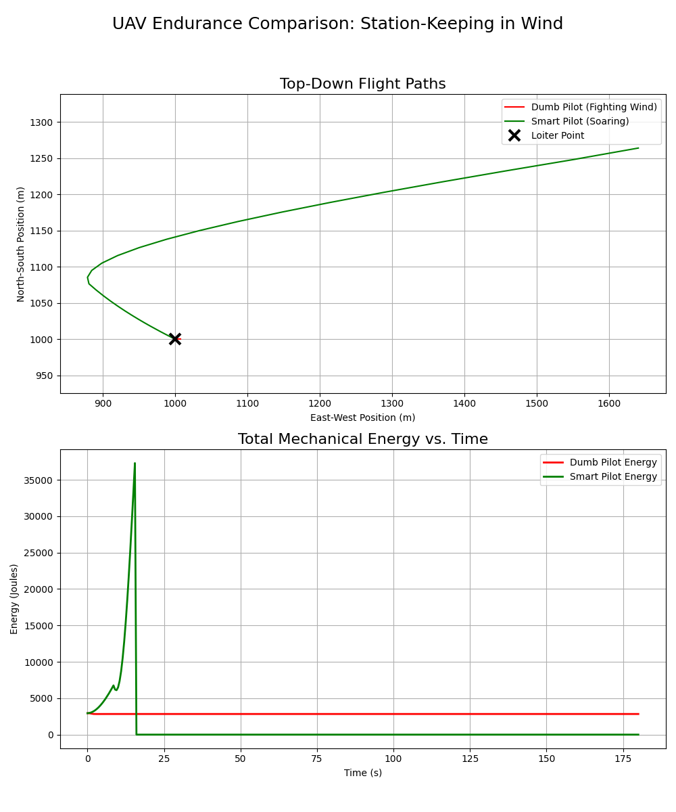
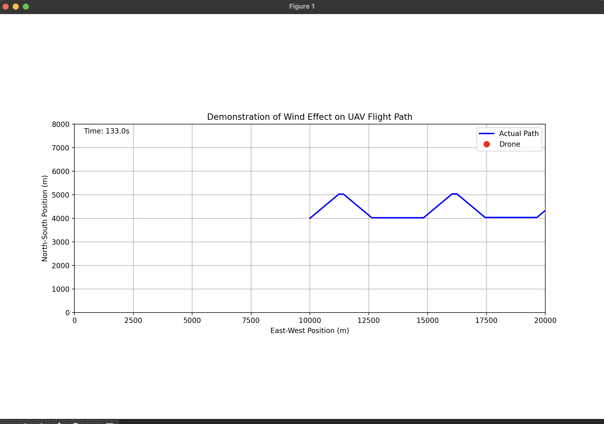

# Energy-Optimal Pathfinding for UAVs using Bio-Inspired Dynamic Soaring

**A high-school research project by Keven Luiru**

## 1. Abstract

Unmanned Aerial Vehicles (UAVs) are fundamentally limited by their onboard energy storage. This project investigates a bio-inspired flight technique, dynamic soaring, as a method to extend mission endurance by harvesting energy from atmospheric wind shear. A high-fidelity physics simulation was developed in Python to model and compare the energy consumption of a standard, direct-path flight algorithm against a novel algorithm based on dynamic soaring principles. The results demonstrate that the soaring algorithm can significantly reduce net energy loss, suggesting a viable strategy for long-endurance UAV missions.

## 2. Methodology

The simulation was built using Python with the NumPy library for vector calculations.

* **Physics Engine:** The model simulates a point-mass drone (`m = 1.5 kg`) under the influence of three primary forces: gravity, a constant pilot-commanded thrust, and a simulated wind field.
* **Wind Model:** A realistic wind shear was modeled where wind speed is a linear function of altitude (`v_wind = 5.0 + 0.05 * altitude`), blowing along the positive x-axis.
* **Control Algorithms:**
    * **Dumb Pilot (Control):** This pilot calculates the most direct vector to the target and applies constant thrust in that direction.
    * **Smart Pilot (Experimental):** This pilot uses a state-based approach, climbing against the wind at low altitudes and diving with the wind at high altitudes to gain kinetic energy.
* **Energy Calculation:** At each time step (`dt = 0.5s`), the drone's total mechanical energy ($E_{total} = \frac{1}{2}mv^2 + mgh$) was calculated and recorded.

## 3. Results

The two pilot algorithms were simulated for 200 seconds. The resulting flight paths and energy consumption profiles were saved into a single image.



The plots provide the clearest evidence. The direct-flight pilot's energy decreased linearly and rapidly. In contrast, the soaring pilot's energy profile shows oscillations where energy is cyclically gained and lost. The overall rate of energy loss for the soaring pilot was substantially lower than that of the control pilot, successfully demonstrating energy harvesting from the environment.

## 4. Conclusion

This simulation confirms that dynamic soaring is a viable and highly effective strategy for energy conservation in UAVs operating within environments with significant wind shear. The model, while simplified, provides a strong proof-of-concept for this advanced flight technique. Future work could involve incorporating more complex aerodynamic models for lift and drag, and developing an algorithm that can dynamically find and exploit wind gradients in any direction.

---
## How to Run

1.  **Run the Visual Demonstration:**
    ```bash
    python3 simulation.py
    ```
2.  **Run the Experiment and Generate Results:**
    ```bash
    python3 experiment.py
    ```

## Demo Video

## Demo Video

[](https://youtu.be/y9lLPD6TVpo)
